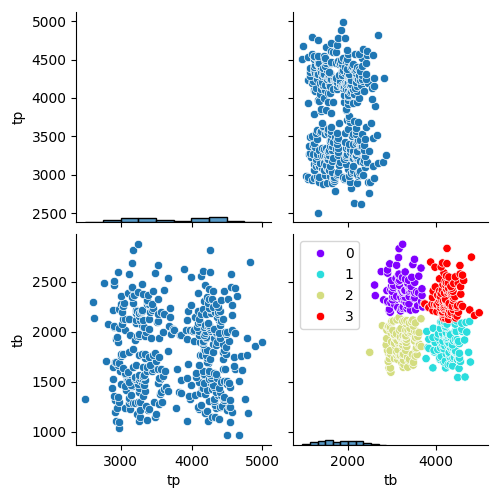
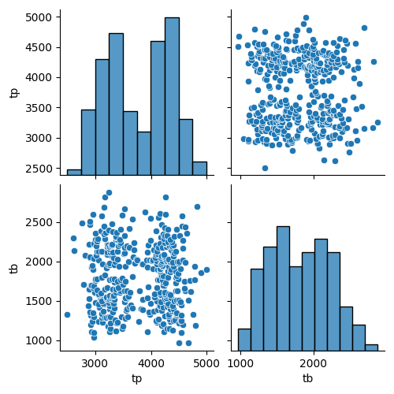

# Índex
1. [Port del Cantó: Simulació de Ciclisme i Anàlisi amb IA](#portcanto)
2. [Descripció del Projecte](#descripcio)
3. [Objectius](#objectius)
4. [Tipologies de Cliclistes](#tipologies)
5. [Estructura del Projecte](#estructura)
6. [Requisits](#requisits)
7. [Configuració de l'Entorn Virtual](#configuracio)
8. [Documentació](#documentacio)
9. [Testing](#testing)
10. [Com Executar el Projecte](#execucio)
11. [Notes Addicionals](#notes)
12. [Llicència](#licence)

## Port del Cantó: Simulació de Ciclisme i Anàlisi amb IA <a name="portcanto"></a>

### Descripció del Projecte <a name="descripcio"></a>
El Port del Cantó és un port de muntanya que uneix les comarques de l’Alt Urgell (Adrall) i el Pallars Sobirà (Sort). La pujada té una distància de 18 km, igual que la baixada. Normalment, aquesta pujada es completa en un interval de temps entre 54 i 77 minuts, mentre que la baixada oscil·la entre 24 i 36 minuts.

Aquest projecte consisteix en una simulació de curses ciclistes entre Adrall i Sort, amb la generació de dades sintètiques que representen diferents patrons de ciclistes. El focus principal és l’anàlisi de dades mitjançant algorismes d’intel·ligència artificial, concretament el clustering.

### Objectius <a name="objectius"></a>
- Simular comportaments reals de ciclistes que pugen i baixen el Port del Cantó.
- Generar un dataset sintètic que permeti l’anàlisi de dades.
- Identificar patrons mitjançant l’algorisme de clustering K-Means.
- Validar la qualitat del clustering utilitzant MLflow per a seguiment i experimentació.

### Tipologies de Ciclistes <a name="tipologies"></a>
S’han definit quatre patrons principals de ciclistes:
- **BEBB**: Bons escaladors i bons baixadors.
- **BEMB**: Bons escaladors i mals baixadors.
- **MEBB**: Mals escaladors i bons baixadors.
- **MEMB**: Mals escaladors i mals baixadors.

### Components del Projecte <a name="components"></a>
Aquest projecte consta de quatre scripts principals:

1. **`generardataset.py`**
   - Genera dades simulades i les guarda a la carpeta `data/`.
   - Simula els quatre comportaments definits, donant lloc a quatre categories o clústers.

2. **`clustersciclistes.py`**
   - Aplica l’algorisme K-Means al dataset generat.
   - Identifica i visualitza els quatre clústers, assumint que K=4 és la millor opció inicial.

3. **`mlflowtracking-K.py`**
   - Realitza experiments amb MLflow per validar que el valor de K=4 és adequat per al clustering.
   - Permet fer seguiment dels resultats i comparar iteracions.

4. **`prediccionousvalors.py`**
   - Utilitza el model de clustering entrenat per fer prediccions sobre noves dades.
   - Permet categoritzar nous ciclistes segons els quatre patrons establerts.

### Estructura del Projecte <a name="estructura"></a>
- **`data/`**: Conté les dades generades pel script `generardataset.py`.
- **`scripts/`**: Inclou els quatre scripts esmentats.
- **`results/`**: Emmagatzema visualitzacions i sortides dels experiments.

### Requisits <a name="requisits"></a>
- Python 3.8 o superior
- Llibreries necessàries:
  - `numpy`
  - `pandas`
  - `matplotlib`
  - `sklearn`
  - `mlflow`
  - `pylint`
  - `pdoc`

### Configuració de l’Entorn Virtual <a name="configuracio"></a>
Per configurar l’entorn virtual i instal·lar les dependències necessàries, s’han seguit els passos següents:
1. Crear l’entorn virtual:
   ```bash
   python -m venv portcanto
   ```
2. Activar l’entorn virtual:
   - Windows:
     ```bash
     ./Scripts/activate
     ```
   - Linux/MacOS:
     ```bash
     source ./bin/activate
     ```
3. Verificar la versió de Python:
   ```bash
   python --version
   ```
   Resultat esperat: `Python 3.11.7`

4. Instal·lar les llibreries necessàries:
   
   Opció a partir del fitxer requirements:

   ```bash
   pip install -r requirements.txt
   ```
   
   Opció a partir de llibreries:

   ```bash
   pip install --upgrade pip
   pip install numpy pandas seaborn scikit-learn mlflow pylint pdoc
   ```

### Generació de Documentació <a name="documentacio"></a>
S’ha utilitzat `pdoc` per generar la documentació automàtica dels scripts:
- Documentar `generardataset.py`:
  ```bash
  pdoc --output-dir docs generardataset.py
  ```
- Documentar `clustersciclistes.py`:
  ```bash
  pdoc --output-dir docs clustersciclistes.py
  ```

### Testing <a name="testing"></a>
S’han implementat tests per validar el comportament dels scripts. Els tests es poden executar amb:
```bash
python -m unittest discover -s tests
```

### Com Executar el Projecte <a name="execucio"></a>
1. Executar `generardataset.py` per generar el dataset.
   ```bash
   python generardataset.py
   ```
2. Aplicar l’algorisme de clustering amb `clustersciclistes.py`.
   ```bash
   python clustersciclistes.py
   ```
Imatges obtingudes:





3. Realitzar el seguiment d’experiments amb MLflow utilitzant `mlflowtracking-K.py`.
   ```bash
   python mlflowtracking-K.py
   ```
4. Fer prediccions amb dades noves utilitzant `prediccionousvalors.py`.
   ```bash
   python prediccionousvalors.py
   ```

### Notes Addicionals <a name="notes"></a>
Aquest projecte és una eina educativa per explorar l’aplicació de mètodes de clustering en dades sintètiques. Els resultats poden variar segons els paràmetres utilitzats en la simulació i el model.

### Autoria <a name="autoria"></a>
Aquest projecte ha estat desenvolupat amb l’objectiu d’explorar metodologies d’intel·ligència artificial aplicades a problemes reals de simulació esportiva. Jose Miguel Garcia Molinero. IOC - desembre 2024

### Llicència <a name="licence"></a>
Jose Miguel Garcia Molinero (2024)
Llicència MIT. [LICENSE.txt](LICENSE.txt) per més detalls